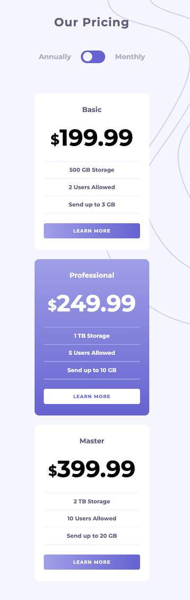
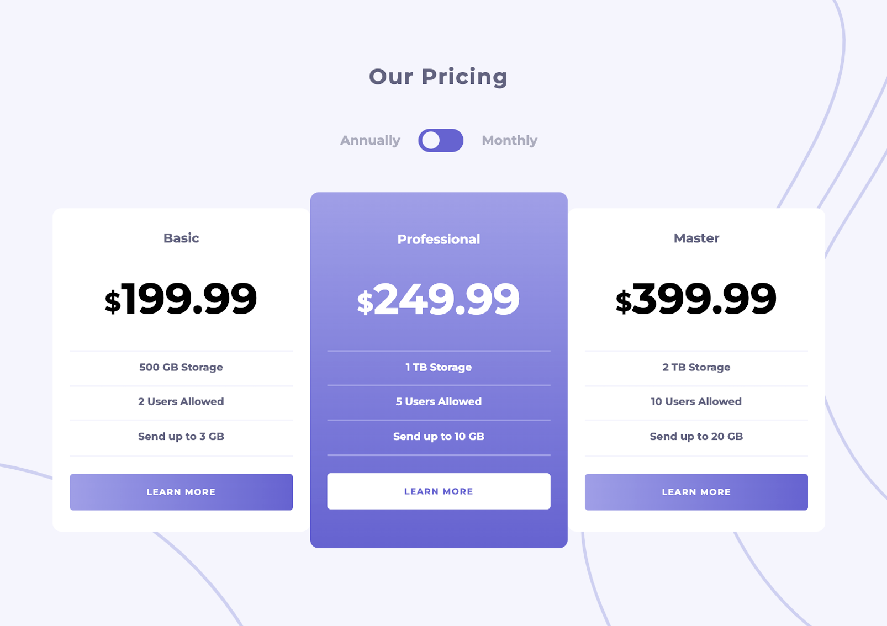

# Frontend Mentor - Pricing component with toggle solution

This is a solution to the [Pricing component with toggle challenge on Frontend Mentor](https://www.frontendmentor.io/challenges/pricing-component-with-toggle-8vPwRMIC). Frontend Mentor challenges help you improve your coding skills by building realistic projects. 

## Table of contents

- [Overview](#overview)
  - [The challenge](#the-challenge)
  - [Screenshot](#screenshot)
  - [Links](#links)
- [My process](#my-process)
  - [Built with](#built-with)
  - [What I learned](#what-i-learned)
  - [Continued development](#continued-development)
  - [Useful resources](#useful-resources)
- [Author](#author)
- [Acknowledgments](#acknowledgments)

## Overview

### The challenge

Users should be able to:

- View the optimal layout for the component depending on their device's screen size
- Control the toggle with both their mouse/trackpad and their keyboard
- **Bonus**: Complete the challenge with just HTML and CSS

### Screenshot

### Links

- Solution URL: [GitHub](https://github.com/MCDoodle1/Pricing-component)
- Live Site URL: [Pricing-component]([https://your-live-site-url.com](https://mcdoodle1.github.io/Pricing-component/))

## My process

I started by writing the HTML and then styled the page with CSS. Most difficult part was the toggle button and adjusting the background image took me some time. 
I tried to use CSS only and tried the "Check Box Hack" but failed. Then I added the toggle functionality with JavaScript.

### Built with

- Semantic HTML5 markup
- CSS custom properties
- Flexbox
- CSS Grid
- BEM
- JavaScript

### What I learned

I learned how to make a toggle button in CSS. I tried to do the HTML/CSS-only challenge but did not get the CSS Checkbox Hack to work. I think this is because my HTML does not allow the use of ~ and/or + - selectors.
I appreciate input from anyone who can help make me achieve this.

### Continued development

In future projects I want to extend my knowledge of HTML, CSS & JavaScript. 

### Useful resources

- [Envatotuts+](https://webdesign.tutsplus.com/tutorials/pricing-table-with-monthly-yearly-css-toggle-switch--cms-93335) - Helped me to add the JavaScript functionality for the week / year toggle.
- [Mozilla](https://developer.mozilla.org/en-US/) - For everything CSS

**Note: Delete this note and replace the list above with resources that helped you during the challenge. These could come in handy for anyone viewing your solution or for yourself when you look back on this project in the future.**

## Author

- Frontend Mentor - [@MCDoodle1](https://www.frontendmentor.io/profile/MCDoodle1)

## Acknowledgments

I read a lot about how to code a toggle button and got most of my inspiration from [leighwhite96] - (https://codepen.io/leighwhite96/pen/WNXdojr)
